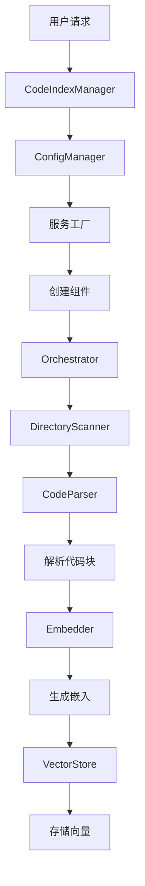
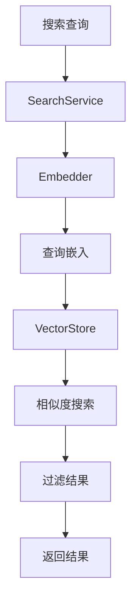

# 代码索引系统架构文档

## 项目结构

```
wally_qin/
├── code_index/                 # 主要模块
│   ├── __init__.py            # 模块入口
│   ├── interfaces/            # 接口定义
│   │   └── __init__.py        # 核心接口和数据模型
│   ├── constants/             # 常量定义
│   │   └── __init__.py        # 系统常量配置
│   ├── vector_store/          # 向量存储
│   │   ├── __init__.py
│   │   └── qdrant_client.py   # Qdrant实现
│   ├── embedders/             # 嵌入器
│   │   ├── __init__.py
│   │   ├── openai_embedder.py # OpenAI实现
│   │   └── ollama_embedder.py # Ollama实现
│   ├── processors/            # 处理器
│   │   ├── __init__.py
│   │   ├── code_parser.py     # 代码解析器
│   │   └── directory_scanner.py # 目录扫描器
│   └── managers/              # 管理器
│       ├── __init__.py
│       ├── code_index_manager.py    # 主管理器
│       ├── config_manager.py        # 配置管理器
│       ├── state_manager.py         # 状态管理器
│       └── cache_manager.py         # 缓存管理器
├── requirements.txt           # 依赖文件
├── example_usage.py          # 使用示例
├── README.md                 # 使用文档
└── ARCHITECTURE.md           # 架构文档
```

## 核心组件架构

### 1. 管理器层 (Managers)

#### CodeIndexManager
- **职责**: 系统主入口，管理整个生命周期
- **模式**: 单例模式，按工作空间路径区分实例
- **功能**: 初始化、协调各组件、提供统一API

#### ConfigManager  
- **职责**: 配置管理和验证
- **功能**: 加载配置、检测配置变化、提供配置访问

#### StateManager
- **职责**: 状态管理和进度报告  
- **功能**: 索引状态跟踪、进度事件发布

#### CacheManager
- **职责**: 文件哈希缓存管理
- **功能**: 增量索引支持、缓存持久化

### 2. 处理器层 (Processors)

#### CodeParser
- **职责**: 代码文件解析
- **技术**: Tree-sitter + 自定义Markdown解析
- **功能**: 多语言解析、智能分块、去重

#### DirectoryScanner  
- **职责**: 目录扫描和批处理
- **功能**: 并发文件处理、批量嵌入、错误重试

#### FileWatcher (未完整实现)
- **职责**: 文件变化监听
- **技术**: watchdog
- **功能**: 实时增量更新

### 3. 嵌入器层 (Embedders)

#### OpenAIEmbedder
- **职责**: OpenAI API集成
- **功能**: 批处理、速率限制、重试机制

#### OllamaEmbedder
- **职责**: 本地Ollama服务集成  
- **功能**: 本地模型支持

#### 扩展性
- 支持新增其他嵌入服务
- 统一的IEmbedder接口

### 4. 向量存储层 (Vector Store)

#### QdrantVectorStore
- **职责**: Qdrant向量数据库集成
- **功能**: 向量CRUD、语义搜索、路径过滤

#### 特性
- 自动集合管理
- 维度变更检测
- 路径分段索引

### 5. 接口层 (Interfaces)

#### 核心接口
- `IEmbedder`: 嵌入器接口
- `IVectorStore`: 向量存储接口  
- `ICodeParser`: 代码解析器接口
- `IDirectoryScanner`: 目录扫描器接口
- `IFileWatcher`: 文件监听器接口

#### 数据模型
- `CodeBlock`: 代码块数据结构
- `EmbeddingResponse`: 嵌入响应  
- `VectorStoreSearchResult`: 搜索结果
- `PointStruct`: 向量点结构

## 数据流程

### 索引流程



### 搜索流程



## 设计模式

### 1. 单例模式
- `CodeIndexManager`: 按工作空间管理实例
- 确保资源不重复创建

### 2. 工厂模式  
- `ServiceFactory`: 创建和配置服务组件
- 支持不同配置的服务创建

### 3. 观察者模式
- 事件系统: 进度更新、状态变化
- 异步事件处理

### 4. 策略模式
- 多种嵌入器实现
- 运行时切换嵌入策略

### 5. 模板方法模式
- 处理器的通用流程定义
- 具体实现的灵活扩展

## 异步架构

### 并发模型
- **异步IO**: 所有IO操作异步化
- **任务并发**: 文件解析并发处理
- **批处理**: 嵌入和向量操作批量处理

### 性能优化
- **连接池**: 数据库连接复用
- **批量操作**: 减少网络往返
- **增量处理**: 只处理变更文件
- **内存管理**: 流式处理大文件

## 错误处理

### 分层错误处理
1. **服务级**: 连接失败、API错误
2. **处理级**: 解析失败、编码错误  
3. **系统级**: 配置错误、资源不足

### 恢复机制
- **重试机制**: 指数退避重试
- **降级处理**: 部分功能可用
- **状态保持**: 错误状态持久化

## 扩展点

### 1. 新语言支持
- 添加Tree-sitter语言包
- 扩展语言映射配置
- 自定义解析规则

### 2. 新嵌入器
- 实现IEmbedder接口
- 注册到服务工厂
- 配置管理支持

### 3. 新向量存储
- 实现IVectorStore接口
- 适配器模式集成
- 配置管理扩展

### 4. 自定义处理器
- 实现处理器接口
- 插件化架构支持
- 配置驱动加载

## 配置管理

### 配置层次
1. **默认配置**: 系统默认值
2. **环境配置**: 环境变量覆盖
3. **用户配置**: 运行时配置
4. **动态配置**: 运行时调整

### 配置验证
- **类型检查**: Pydantic模型验证
- **依赖检查**: 服务可用性验证
- **约束检查**: 业务规则验证

## 监控和可观测性

### 指标收集
- **性能指标**: 处理速度、响应时间
- **业务指标**: 文件数量、代码块数量
- **错误指标**: 错误率、重试次数

### 日志管理
- **结构化日志**: JSON格式输出
- **日志级别**: DEBUG/INFO/WARN/ERROR
- **上下文传递**: 请求跟踪ID

### 健康检查
- **服务健康**: 依赖服务状态
- **资源健康**: 内存、磁盘使用
- **业务健康**: 索引完整性

## 部署架构

### 本地部署
- **单机模式**: 所有组件同机部署
- **Docker化**: 容器化部署
- **依赖管理**: Docker Compose编排

### 分布式部署
- **服务分离**: 组件独立部署
- **负载均衡**: 多实例水平扩展
- **状态管理**: 外部状态存储

### 云原生部署
- **Kubernetes**: 容器编排
- **服务网格**: 微服务通信
- **自动扩缩**: 基于负载调整

---

这个架构设计保证了系统的：
- **可扩展性**: 模块化设计，易于扩展
- **可维护性**: 清晰的分层和职责分离
- **可测试性**: 接口抽象，便于单元测试
- **高性能**: 异步并发，批处理优化
- **可靠性**: 错误处理，状态管理